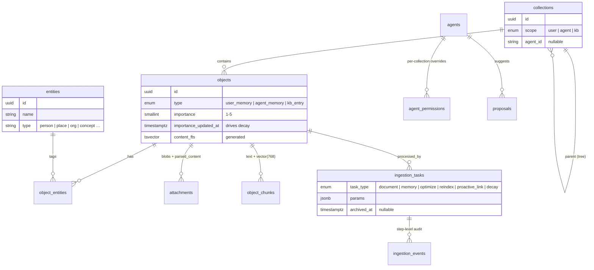
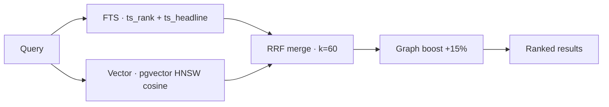
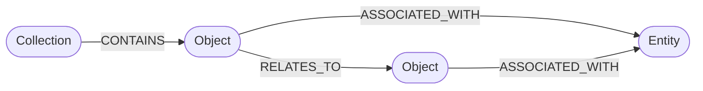
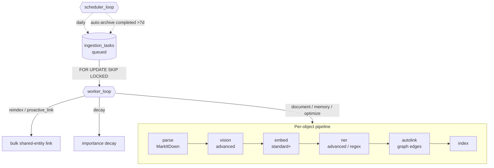

# Architecture

## Data model



**Object** is the atom: `subject` + `content`, an `object_type`
(`user_memory` / `agent_memory` / `kb_entry`), an `importance` (1–5) with an
`importance_updated_at` clock for time-based decay, tags (in metadata), entities
(many-to-many), an optional collection, and a `content_fts` generated `tsvector`
column for full-text search.

**Collections** form a tree and carry a `scope`. Agent-scoped collections belong to a
single agent (`agent_id`) and are invisible to other agents.

## The privacy filter

Every read an agent makes is constrained so it only sees:

```sql
type IN ('user_memory', 'kb_entry')
OR (type = 'agent_memory' AND contributor_id = <this agent>)
```

Humans bypass the filter. This is enforced centrally in `auth/middleware.py` and
applied to list, get, and search.

## Search pipeline

`hybrid_search()` runs each stage in its **own isolated DB session** so a failure in
one can never poison another:



1. **FTS** — `ts_rank` over `content_fts @@ plainto_tsquery`, with `ts_headline`
   snippets (`<mark>` highlights).
2. **Vector** — (standard/advanced) embed the query via the configured provider, cosine
   search over `object_chunks.embedding` (pgvector HNSW).
3. **RRF merge** — Reciprocal Rank Fusion (`k=60`) fuses the two ranked lists.
4. **Graph boost** — objects linked (in AGE) to the top results get a +15% score bump.
5. (rerank hook) — final ordering returned to the API, which enriches objects.

Each stage degrades gracefully: no pgvector → FTS-only; no AGE → no boost.

## Knowledge graph

Apache AGE stores `Object`, `Entity` and `Collection` vertices and edges
(`CONTAINS`, `ASSOCIATED_WITH`, `RELATES_TO`, …). All graph writes run in isolated
sessions via `services/graph_svc.py`, because AGE requires a per-connection
`search_path` and a failed Cypher statement aborts the surrounding transaction.



> Implementation note: this AGE build doesn't support `MERGE … ON CREATE SET`; the
> service uses `MERGE` + an idempotent `SET` instead. Cypher is run through the raw
> driver (`exec_driver_sql`) so SQLAlchemy doesn't mistake openCypher colons for bind
> parameters.

Creating an object registers its vertex and links it to its collection and entities;
`auto_link_by_shared_entities` then connects it to existing objects that share
entities. The graph view (`GET /api/v1/graph`) returns object **and** entity nodes
(entity associations are read straight from the relational `object_entities` table, so
they render even if AGE is offline) plus all `RELATES_TO` edges.

### Edge (re)indexing

Shared-entity edges can be rebuilt in bulk, Obsidian-style, as a tracked task:

- **additive** — only create missing edges (fast, incremental)
- **full** — wipe all `RELATES_TO` edges and rebuild from scratch

`POST /api/v1/graph/reindex?mode=additive|full` enqueues a `reindex` task; the daily
`proactive_link` job runs the additive pass automatically.

## Background pipeline & scheduler

A supervised worker (auto-restarting with backoff) drains a queue of tasks; a separate
supervised scheduler enqueues daily maintenance. Both are started in the app lifespan.



- **document** → `parse · vision · embed · ner · autolink · index`. **parse** extracts
  markdown text (MarkItDown) **and** every embedded image — PDFs via `pypdf`
  (`page.images`), Office files (docx/pptx/xlsx) from their zip `media/` folders. Those
  images are saved as **attachments in all modes** (independent of OCR), so they're never
  lost; `vision` (advanced) then describes them in place.
- **memory** → `embed · ner · autolink · index`
- **optimize** → phase-2 re-run (`embed · ner · autolink · index`) on an existing
  object — upgrade an entry created in light mode without re-uploading.
- **reindex / proactive_link** → bulk shared-entity edge build (additive or full).
- **decay** → daily importance decay: non-pinned items idle ≥ 7 days drop one level
  (floor 1). Runs under `SET LOCAL mp.skip_touch='on'` so decay doesn't bump
  `updated_at` and make items look freshly edited.

Each step records `running` → `completed`/`skipped`/`failed`. Uploads are
fire-and-forget: `/ingest` returns `202` immediately. On restart, any task left
`running` is re-queued (single-worker ownership). The frontend polls the **Tasks**
endpoints and renders each task's execution history — including the edges `autolink`
created. Completed/failed tasks auto-archive after 7 days (or manually anytime).

**Failures are never silent.** A bad model or unreachable endpoint produces a clear,
actionable error (e.g. *"ocr model 'gemma4:e4b' not found (404) … fix `OCR_MODEL`"*).
Enrichment steps (embed / vision / ner) that fail are marked **failed** in the
execution history, the pipeline keeps going so the object is still saved, and the
**task is marked `failed`** with the reason in `error_message` — visible (red) in the
Tasks list, not a green "completed". Re-run **Optimize** on the object once the model
is fixed. (A model that merely returns malformed output is a soft skip, not a failure.)

## Agent capabilities & proposals

An agent's access is defined solely by its **capabilities** (`read_memory`, `read_kb`,
`link_nodes`, `write_memory`, `write_kb`) — there is no separate permission level.
Enforcement lives in `auth/middleware.py` (`agent_can_write_target`, `assert_can_link`).

When an agent attempts something **outside its scope** (write a memory/doc without the
write capability, or link without `link_nodes`), the API doesn't reject it — it records
the attempt as a **proposal** and returns `202`. A human reviews the queue; on approve the
backend materializes the change (memory, document, edit, deletion, or connection). So
assistants are useful by default and never unilaterally destructive — out-of-scope
actions degrade to suggestions instead of errors.

**Revocation cleanup.** Revoking an agent (`DELETE /agents/{id}`) purges its private
footprint by default: its `agent_memory` objects, its agent-scoped collections (and
contents), pending proposals, and the graph vertices/edges + ingestion tasks for those
objects. Shared `user_memory` / `kb_entry` it wrote stays — that belongs to the
user/knowledge base. Pass `?purge=false` to revoke access without deleting anything.

## Frontend

A single React 19 SPA (Vite, TanStack Query), served by the backend in production.

- **Design system** — CSS-variable tokens with full light/dark themes
  (`styles/tokens.css`), a small component kit (`components/ui`), and a no-flash
  theme boot script.
- **Tree + table** — reusable `TreeTableLayout` (resizable tree + sortable,
  multi-select table) powers the specialized memory pages; collapses to a card list
  + drawer on mobile.
- **Graph** — D3 force layout with object + entity nodes, per-type filtering,
  importance-scaled node sizes, fit-to-view, re-layout, and inline edge reindexing.
- **Responsive / PWA** — `useIsMobile`, a slide-out nav drawer, stacking grids, and a
  web manifest with icons (installable on phones).
```
