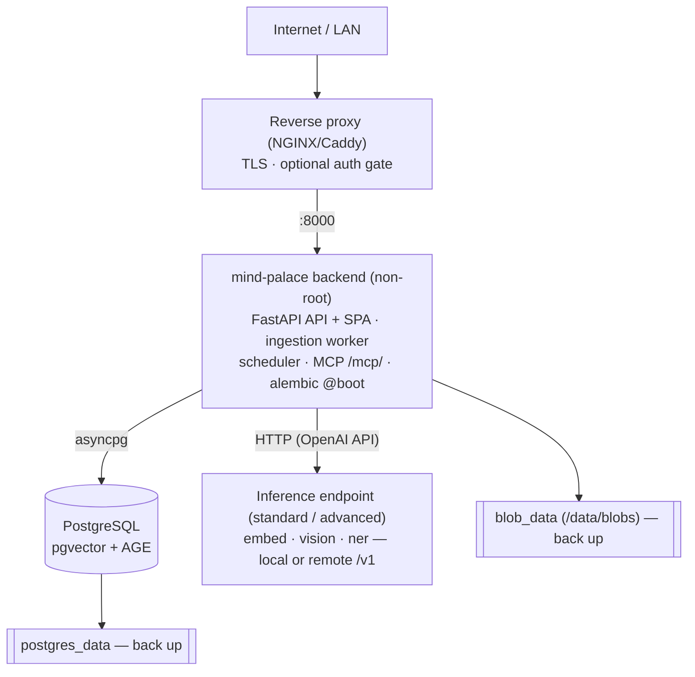

# Deployment Guide

## 1. Prerequisites

- Docker + Docker Compose
- (standard/advanced modes) An **OpenAI-compatible inference endpoint** — local
  ([Ollama](https://ollama.com), LM Studio, vLLM…) or remote (OpenAI, Together,
  any `/v1`-compatible API).
- A PostgreSQL 16 image with **pgvector** and **Apache AGE** extensions. The repo
  ships one — `docker/postgres.Dockerfile` (pgvector base + AGE compiled for PG16).
  The dev `docker-compose.yml` builds it automatically; for prod, build & set it:
  ```bash
  docker build -f docker/postgres.Dockerfile -t mind-palace-db:pg16 .
  export POSTGRES_IMAGE=mind-palace-db:pg16   # or push to your registry
  ```
  (Without AGE the app still runs — FTS + vectors work — but the knowledge graph is disabled.)

## 2. Configure

```bash
cp .env.example .env
```

Set at minimum:

```ini
ENVIRONMENT=production
ENABLE_DOCS=false
DEPLOYMENT_MODE=standard
POSTGRES_PASSWORD=<long-random-secret>
CORS_ORIGINS=["https://your-host"]

# Inference (standard/advanced). One endpoint configures all providers…
INFERENCE_BASE_URL=http://host.docker.internal:11434/v1
INFERENCE_API_KEY=not-needed
EMBEDDING_MODEL=nomic-embed-text
```

### Independent providers (optional)

Embedding, LLM and OCR each speak the OpenAI API and inherit `INFERENCE_BASE_URL`
/ `INFERENCE_API_KEY` by default. Override any one to split it onto its own host —
e.g. embeddings on a local Ollama, generation on a remote model:

```ini
EMBEDDING_BASE_URL=http://host.docker.internal:11434/v1
EMBEDDING_MODEL=nomic-embed-text
LLM_BASE_URL=https://api.openai.com/v1
LLM_API_KEY=sk-...
LLM_MODEL=gpt-4o-mini
OCR_BASE_URL=http://host.docker.internal:11434/v1
OCR_MODEL=gemma4:e4b
```

## 3. Provide models (standard / advanced)

Point the providers above at models your endpoint serves — e.g. for a local Ollama:

```bash
ollama pull nomic-embed-text          # embeddings (standard, advanced)
ollama pull gemma4:e4b                 # vision + LLM entity extraction (advanced) — multimodal, covers both
```

`light` mode needs no models at all — it runs anywhere.

## 4. Launch

Two paths — build from source, or pull a pre-built image.

### A. Build from source

```bash
docker compose up -d --build
```

### B. Publish to a registry, then pull & deploy

Build once (in CI or locally), push to any container registry, then deploy anywhere by
pulling — no source needed on the server. `docker-compose.prod.yml` references the image
instead of building it.

```bash
# build & publish (anywhere with the source)
export MP_IMAGE=registry.example.com/you/mind-palace:latest
docker build -f backend/Dockerfile -t "$MP_IMAGE" .
docker push "$MP_IMAGE"

# on the server — just pull & run
export MP_IMAGE=registry.example.com/you/mind-palace:latest
docker compose -f docker-compose.prod.yml pull
docker compose -f docker-compose.prod.yml up -d
```

The image bundles the built SPA and runs `alembic upgrade head` on startup, so the
server only needs the image, a Postgres, and an `.env`.

- Postgres comes up first (with a healthcheck gate).
- On startup the backend runs **`alembic upgrade head`** — the single initial
  migration creates the schema, including the pgvector + Apache AGE extensions if
  available. Missing extensions degrade gracefully (FTS still works without vectors;
  the app still works without the graph). The migration is idempotent, so restarts
  and upgrades are safe.
- The backend container serves both the API and the built SPA on port `8000`.

## 5. Deployment view

A minimal single-host topology. The backend image bundles the API **and** the SPA, so
only one app container is needed; Postgres and the inference endpoint sit behind it.



| Component | Port | Persisted | Notes |
|---|---|---|---|
| Reverse proxy | 80/443 | — | terminates TLS; add SSO here if public |
| `mind-palace` backend | 8000 | `blob_data` | API + SPA + worker + MCP; non-root; healthchecked |
| PostgreSQL | 5432 | `postgres_data` | pgvector + AGE |
| Inference endpoint | varies | (its own) | OpenAI-compatible; only for `standard`/`advanced` |

**Scaling notes.** The app runs one Uvicorn worker with a supervised background
ingestion loop; scale vertically (CPU/RAM) first. To run multiple API replicas, move
the ingestion worker to a dedicated single instance so tasks aren't double-processed
(the worker uses `SELECT … FOR UPDATE SKIP LOCKED`, so it's safe, but one worker keeps
ordering simple). Postgres is the single source of truth; back it up (see §8).

## 6. Reverse proxy

Front the backend with your proxy of choice (NGINX, Caddy, Traefik, NPM). Minimum:

```nginx
location / {
    proxy_pass http://mind-palace:8000;
    proxy_set_header Host $host;
    proxy_set_header X-Forwarded-For   $proxy_add_x_forwarded_for;
    proxy_set_header X-Forwarded-Proto $scheme;
    proxy_read_timeout 300s;   # MCP Streamable HTTP
    proxy_buffering off;       # MCP streaming responses
}
```

> **Streaming note:** the MCP transport at `/mcp/` uses Streamable HTTP, so keep
> `proxy_buffering off` and a generous read timeout for that path.

### Access control

The app treats un-tokened requests as the single admin user — fine for a personal,
single-user deployment behind a private network or tunnel. For anything exposed
publicly, put an **authentication gate at the reverse-proxy layer** (e.g. Authentik /
oauth2-proxy forward-auth, or your IdP). The application's own auth handles *agent*
tokens; human SSO belongs at the edge.

## 7. Health checks

| Endpoint | Use |
|---|---|
| `/live` | container/orchestrator liveness (the Docker `HEALTHCHECK` uses this) |
| `/ready` | readiness — returns `503` until the database is reachable |
| `/api/v1/health` | full status: db + inference providers + mode |

## 8. Operations

**Logs** are structured with request IDs and timings:

```
2026-06-27 08:00:00 INFO mind_palace.request: POST /api/v1/objects -> 201 (42.1ms) [e7e08b331427]
```

**The ingestion worker** is supervised — if it crashes it restarts with exponential
backoff, so transient failures never silently stop ingestion.

**Resource limits** are set in `docker-compose.yml` (backend 2 GB, postgres 1 GB) — tune for your box.

### Troubleshooting inference / models

Both compose files **forward your whole `.env`** into the backend container (`env_file`),
so any `EMBEDDING_MODEL` / `LLM_MODEL` / `OCR_MODEL` (and per-provider `*_BASE_URL` /
`*_API_KEY`) you set takes effect. Settings are read **at container start** — `docker
compose up -d` (recreate), not just `restart`, after changing them.

If embeddings or vision aren't working, **check the Tasks page** — failures are surfaced,
never silent. A misconfigured model shows a red **failed** task with a clear reason, e.g.:

```
ocr model 'gemma4:e4b' not found (404) at http://ollama:11434/v1/chat/completions
— pull it on the inference endpoint or fix OCR_MODEL.
```

Confirm what the backend actually loaded at `/api/v1/health` (`mode`, `inference.*.model`).
Note Ollama tags must exist on the endpoint (`ollama list`); the base URL is normalized
so `http://host:11434` and `http://host:11434/v1` both work. Fix the model and re-run
**Optimize** on the affected entry.

### Backups

Back up the Postgres volume (objects, collections, embeddings, graph) and the blob
volume (`/data/blobs`, uploaded files):

```bash
docker exec mp_postgres pg_dump -U mindpalace mindpalace | gzip > backup-$(date +%F).sql.gz
docker run --rm -v mind-palace_blob_data:/d -v "$PWD":/out alpine \
  tar czf /out/blobs-$(date +%F).tgz -C /d .
```

## 9. Upgrading

```bash
git pull
docker compose up -d --build      # rebuilds image, recreates container
```

The build copies a fresh production SPA into the image. Recreate (not just restart)
the container so the new image is used.
